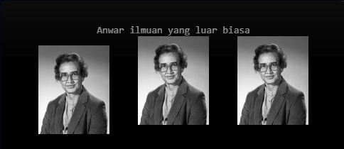
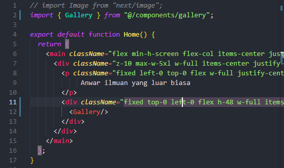
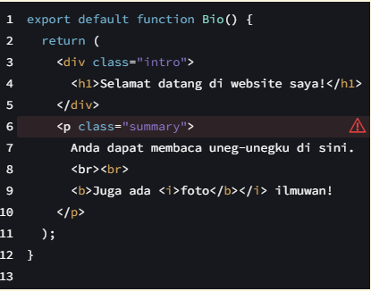
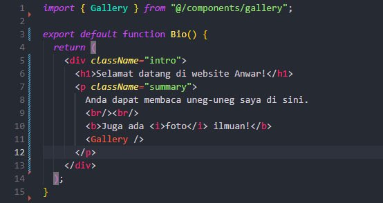
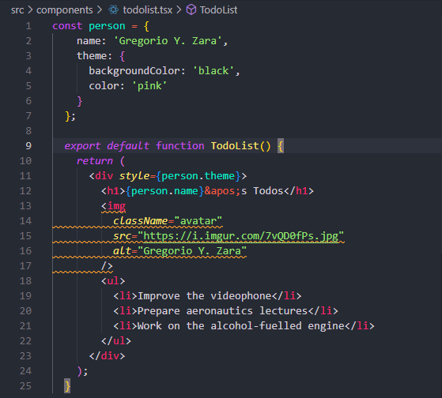

|  | Pemrograman Berbasis Framework 2024 |
|--|--|
| NIM |  2341728026|
| Nama |  Anwar Alif Katresna |
| Kelas | TI - 3A |

## Praktikum 1: Mendefinisikan Komponen
>**Soal 1** Ubah isi kode Home() sehingga dapat tampil seperti berikut dengan memanfaatkan komponen Profile() yang tadi sudah dibuat dari langkah 1 tersebut   

Setelah membuat komponen kita dapat memangil komponen tersebut dengan cara mengimport (nama-komponen) lalu memasukannya kedalam faunction dengan memanggil nama komponen cth: "< profile/ >"

## Praktikum 2: Mengimpor dan Mengekspor Komponen   
>**Soal 2** Capture hasilnya dan buatlah laporan di README.md. Jelaskan apa yang telah Anda pelajari dan bagaimana tampilannya saat ini?

Kertika kita sudah membuat komponen dan mengekspor komponen tersebut, kita dapat memanggil komponen tersebut melalui folder komponen lain yang telah memanggil komponen sebelumnya, sehingga ketika kita memanggil komponen Gallery hasil yang ditampilkan sama dengan memanggil komponen sebelumnya (Profile).

>**Soal 3** Silakan perbaiki kode JSX berikut ini. Anda boleh menggunakan konverter atau perbaiki secara manual.

  
Error terjadi karena ada kesalahan dalam perstrukturan kode:  
- Penempatan elemen paragraf "< p >" yang tidak masuk ke dalam elemen "< div >"
- Kesalahan pada tag < br>, dimana harusnya ada '/' < br/>
- Kesalahan penutupan pada tag < b> dan < i> tidak sesuai urutan.

## Praktikum 3: Menggunakan JSX dinamis  

>**Soal 4** 

perubahan yang dilakukan adalah mengganti {person} dengan {person.name} di dalam tag h1, karena kita ingin menampilkan nama dari objek person. Kemudian mengganti tanda kutip tunggal " ' " sebelum s Todos dengan " &apos ;".

