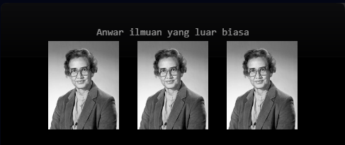

|  | Pemrograman Berbasis Framework 2024 |
|--|--|
| NIM |  2341728026|
| Nama |  Anwar Alif Katresna |
| Kelas | TI - 3A |

## Praktikum 1: Mendefinisikan Komponen
>**Soal 1** Ubah isi kode Home() sehingga dapat tampil seperti berikut dengan memanfaatkan komponen Profile() yang tadi sudah dibuat dari langkah 1 tersebut   

Setelah membuat komponen kita dapat memangil komponen tersebut dengan cara mengimport (nama-komponen) lalu memasukannya kedalam faunction dengan memanggil nama komponen cth: "< profile/ >"

